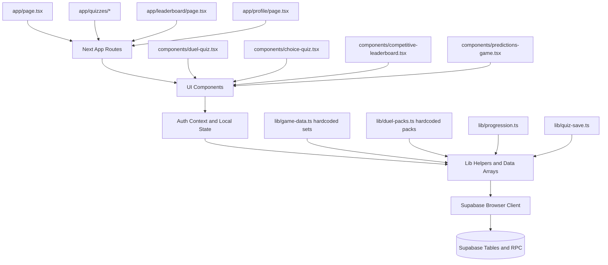
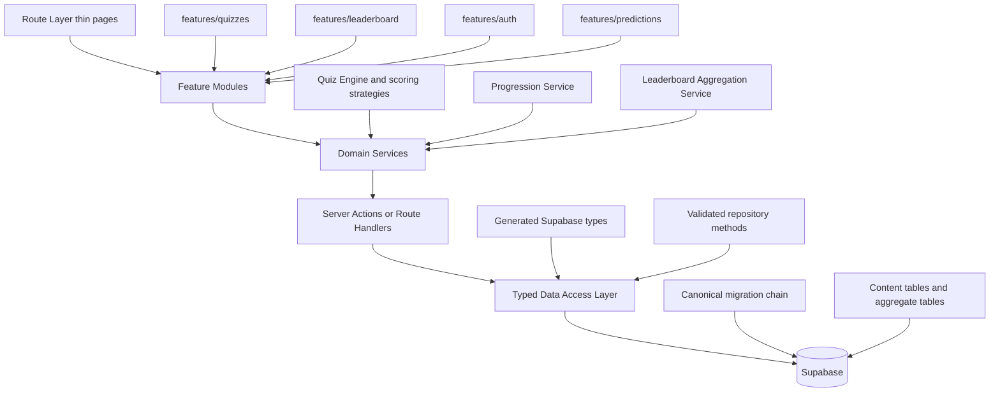

# Sprint 1 Architecture and Product Audit

Date: 2026-07-24  
Repository: refdecision-v2-referee-rating  
Branch: feature/product-upgrade-list-challenge-v1  
Mode: Read-only audit, no runtime implementation changes

## Executive Summary

FootballIQ has a strong gameplay core, clear early differentiation in Football Duels, and a coherent dark-mode visual language. The product already contains enough playable value to justify private beta progression if stability and data integrity are hardened first.

The biggest structural concern is not UI quality. The biggest concern is architecture drift across SQL baselines, client-only data write paths, and dual-era component inventory (active route stack plus legacy section-based component set). This creates launch risk through operational confusion rather than visible frontend breakage.

The product should continue forward with focused foundation repair, not redesign.

## Scope Completed

This audit covers:

1. Folder structure
2. Component architecture
3. Code duplication
4. Shared hooks
5. Data flow
6. Supabase architecture
7. Performance
8. Loading states
9. Mobile responsiveness
10. Accessibility
11. Visual consistency
12. Homepage hierarchy
13. Quiz architecture
14. Reusability
15. Future scalability
16. Content management
17. Scout Vision architecture
18. Referee Arena architecture
19. Football Duels architecture
20. Opportunities to convert hardcoded content into reusable datasets
21. Places where future quiz categories can plug in easily
22. Animation opportunities
23. Empty states
24. Error handling
25. Navigation
26. Authentication flow
27. Technical debt
28. Security
29. Database normalization
30. Launch readiness

## Current Architecture Diagram

## Future Ideal Architecture Diagram

## Detailed Findings

### 1) Mixed-era codebase and inactive legacy surface
- Severity: High
- Why it matters: Two architectural eras coexist. Active app routes use one product shell while many legacy section-based components remain, increasing confusion and accidental regressions.
- Recommended solution: Archive or remove unused legacy components after snapshot; maintain one canonical path.
- Estimated implementation difficulty: Medium
- Should be fixed before launch: Yes
- Blocks future scalability: Yes

### 2) Root-level documentation and SQL sprawl
- Severity: High
- Why it matters: Multiple install notes and SQL scripts create operational ambiguity and increase deployment error probability.
- Recommended solution: Establish one canonical runbook and one canonical migration sequence under docs and migrations.
- Estimated implementation difficulty: Small
- Should be fixed before launch: Yes
- Blocks future scalability: Yes

### 3) No feature-module boundaries
- Severity: High
- Why it matters: Components and domain logic are distributed across app, components, and lib without module ownership.
- Recommended solution: Introduce feature folders with co-located UI, hooks, services, and tests.
- Estimated implementation difficulty: Medium
- Should be fixed before launch: No
- Blocks future scalability: Yes

### 4) Shared hooks limited mostly to auth
- Severity: Medium
- Why it matters: Quiz and leaderboard states are repeatedly rebuilt per component, reducing consistency.
- Recommended solution: Add reusable hooks for quiz lifecycle, leaderboard loading, and save mutation behavior.
- Estimated implementation difficulty: Medium
- Should be fixed before launch: No
- Blocks future scalability: Yes

### 5) Data mutation paths are browser-direct and thinly guarded
- Severity: High
- Why it matters: Core writes depend on client behavior and RPC shape with limited central governance.
- Recommended solution: Add server-side orchestration for critical writes and anti-abuse checks.
- Estimated implementation difficulty: Medium
- Should be fixed before launch: Yes
- Blocks future scalability: Yes

### 6) Supabase client architecture drift
- Severity: Medium
- Why it matters: Multiple client approaches exist; typed SSR files are present but not active while app relies on a generic browser client.
- Recommended solution: Choose one standard and delete or integrate the other.
- Estimated implementation difficulty: Small
- Should be fixed before launch: No
- Blocks future scalability: Medium

### 7) SQL baseline conflict risk
- Severity: Critical
- Why it matters: Different SQL files represent different assumptions about duplicate quiz handling and competitive tables.
- Recommended solution: Define canonical baseline and explicit migration order, then verify live state before execution.
- Estimated implementation difficulty: Medium
- Should be fixed before launch: Yes
- Blocks future scalability: Yes

### 8) Incomplete type safety in data layer
- Severity: Medium
- Why it matters: Partial typing and casting reduce confidence when evolving schema and leaderboard logic.
- Recommended solution: Generate complete database types and enforce typed query helpers.
- Estimated implementation difficulty: Small
- Should be fixed before launch: No
- Blocks future scalability: Medium

### 9) Build gates are weakened
- Severity: High
- Why it matters: Type build errors are ignored and lint cannot be executed in current local environment.
- Recommended solution: Reinstate strict build gates in CI and local scripts.
- Estimated implementation difficulty: Small
- Should be fixed before launch: Yes
- Blocks future scalability: Yes

### 10) Leaderboard aggregation strategy does not scale
- Severity: High
- Why it matters: Client-side aggregation with fixed limits can mis-rank heavy datasets and degrade performance.
- Recommended solution: Push period aggregation into SQL views/functions and paginate results.
- Estimated implementation difficulty: Medium
- Should be fixed before launch: Yes
- Blocks future scalability: Yes

### 11) Loading states are mostly text placeholders
- Severity: Medium
- Why it matters: Slow network users experience uncertainty and lower trust.
- Recommended solution: Add skeleton loaders and deterministic loading UX states.
- Estimated implementation difficulty: Small
- Should be fixed before launch: Yes
- Blocks future scalability: No

### 12) Error handling is inconsistent across flows
- Severity: High
- Why it matters: Some errors are surfaced, others are silent or console-only.
- Recommended solution: Standardize user-facing errors with retry patterns and telemetry.
- Estimated implementation difficulty: Medium
- Should be fixed before launch: Yes
- Blocks future scalability: Medium

### 13) Mobile experience mostly good but has sharp edges
- Severity: Medium
- Why it matters: There are interaction patterns like full reload resets and dense rows that reduce mobile quality.
- Recommended solution: Replace reload actions with state resets and refine compact layouts.
- Estimated implementation difficulty: Small
- Should be fixed before launch: Yes
- Blocks future scalability: No

### 14) Accessibility baseline incomplete
- Severity: High
- Why it matters: Inconsistent labels, focus behavior, and status announcements reduce usability and legal confidence.
- Recommended solution: Full audit pass with keyboard parity, ARIA improvements, and automated checks.
- Estimated implementation difficulty: Medium
- Should be fixed before launch: Yes
- Blocks future scalability: No

### 15) Visual consistency is strong in active routes
- Severity: Low
- Why it matters: Existing mode theming is a product strength and should be preserved.
- Recommended solution: Maintain current theme system while trimming legacy component paths.
- Estimated implementation difficulty: Small
- Should be fixed before launch: No
- Blocks future scalability: No

### 16) Homepage hierarchy is clear but content is hardcoded
- Severity: Medium
- Why it matters: Messaging changes require code edits and increase accidental regression risk.
- Recommended solution: Move homepage content into typed configuration objects.
- Estimated implementation difficulty: Small
- Should be fixed before launch: No
- Blocks future scalability: Medium

### 17) Quiz architecture is reusable in places but lacks a unified engine
- Severity: High
- Why it matters: Some modes smartly reuse ChoiceQuiz while others reimplement state and save flow.
- Recommended solution: Define a quiz engine contract with pluggable scoring and result persistence strategies.
- Estimated implementation difficulty: Medium
- Should be fixed before launch: No
- Blocks future scalability: Yes

### 18) Content management is code-first, not product-ops ready
- Severity: High
- Why it matters: Quiz data changes require deploys; non-technical content iteration is blocked.
- Recommended solution: Move content to database-backed datasets with versioning and validation.
- Estimated implementation difficulty: Large
- Should be fixed before launch: Yes
- Blocks future scalability: Yes

### 19) Scout Vision architecture is clean but static
- Severity: Medium
- Why it matters: Strong wrapper pattern, limited dataset depth and no editorial pipeline.
- Recommended solution: Preserve wrapper pattern and move profile scenarios to structured content tables.
- Estimated implementation difficulty: Medium
- Should be fixed before launch: No
- Blocks future scalability: Yes

### 20) Referee Arena has canonical-path ambiguity
- Severity: Medium
- Why it matters: Active route uses one implementation while richer legacy referee component still exists.
- Recommended solution: Select one canonical Referee Arena architecture and archive the other.
- Estimated implementation difficulty: Medium
- Should be fixed before launch: Yes
- Blocks future scalability: Medium

### 21) Football Duels is strongest mode and should be protected
- Severity: Low
- Why it matters: This mode provides the clearest retention loop and product distinctiveness.
- Recommended solution: Protect gameplay loop, improve backend-backed persistence and anti-abuse controls incrementally.
- Estimated implementation difficulty: Medium
- Should be fixed before launch: No
- Blocks future scalability: Medium

### 22) Hardcoded content conversion opportunities are substantial
- Severity: High
- Why it matters: lib/game-data.ts and lib/duel-packs.ts are excellent starter assets but not scalable ops infrastructure.
- Recommended solution: Introduce quiz sets, questions, answers, tags, and difficulty tables.
- Estimated implementation difficulty: Large
- Should be fixed before launch: Yes
- Blocks future scalability: Yes

### 23) Plugin points for future categories are not centralized
- Severity: Medium
- Why it matters: Adding a new mode requires edits in many files and arrays.
- Recommended solution: Add a mode registry driving routes, cards, metadata, and leaderboard mapping.
- Estimated implementation difficulty: Medium
- Should be fixed before launch: No
- Blocks future scalability: Yes

### 24) Animation opportunities are underused in async moments
- Severity: Low
- Why it matters: Existing mode identity is strong, but loading and completion moments can further increase polish.
- Recommended solution: Add skeleton shimmer, result transitions, and milestone micro-animations.
- Estimated implementation difficulty: Small
- Should be fixed before launch: No
- Blocks future scalability: No

### 25) Empty states are present but could be more actionable
- Severity: Low
- Why it matters: Current text-only empty states miss an opportunity to direct user behavior.
- Recommended solution: Add action prompts, links, and contextual suggestions.
- Estimated implementation difficulty: Small
- Should be fixed before launch: No
- Blocks future scalability: No

### 26) Navigation has stale deep links
- Severity: Medium
- Why it matters: Some profile links target anchors that do not exist.
- Recommended solution: Update links to valid sections or remove stale anchors.
- Estimated implementation difficulty: Small
- Should be fixed before launch: Yes
- Blocks future scalability: No

### 27) Authentication flow is generally sound but lacks robust failure UX
- Severity: Medium
- Why it matters: Callback and profile loading have limited user-facing recovery paths.
- Recommended solution: Add callback timeout fallback, retry actions, and explicit failure states.
- Estimated implementation difficulty: Small
- Should be fixed before launch: Yes
- Blocks future scalability: No

### 28) Security relies heavily on RLS, with limited additional protections
- Severity: High
- Why it matters: Rate limiting and abuse mitigation for write flows are not visibly enforced in app architecture.
- Recommended solution: Add server gatekeeping, request throttling, and mutation logging.
- Estimated implementation difficulty: Medium
- Should be fixed before launch: Yes
- Blocks future scalability: Yes

### 29) Database normalization strategy is partial
- Severity: Medium
- Why it matters: Profile aggregates are useful, but content and competitive aggregation layers are not fully normalized under one source.
- Recommended solution: Keep useful denormalized profile metrics while normalizing content and formalizing aggregate tables.
- Estimated implementation difficulty: Medium
- Should be fixed before launch: Yes
- Blocks future scalability: Yes

### 30) Launch readiness is promising but not yet trustworthy for broad public exposure
- Severity: Critical
- Why it matters: Trust, reliability, and operational consistency gaps remain.
- Recommended solution: Execute a focused foundation sprint before feature expansion.
- Estimated implementation difficulty: Large
- Should be fixed before launch: Yes
- Blocks future scalability: Yes

## Opportunities to Convert Hardcoded Content into Reusable Datasets

1. Referee scenarios in lib/game-data.ts into quiz_questions with law tags and difficulty.
2. Scout profiles in lib/game-data.ts into scout_profiles with attributes and explanation metadata.
3. Career path and who-am-i sets into reusable clue models.
4. Higher-lower item banks into stat snapshots with source and date metadata.
5. Duel packs in lib/duel-packs.ts into pack, pack_question, and question_stat records.
6. Predictions fixtures from static arrays into fixtures and prediction_windows.

## Future Quiz Category Plug-In Points

1. Mode registry layer replacing scattered arrays in app/page.tsx, app/quizzes/page.tsx, lib/competitive.ts, and components/mode-page.tsx.
2. Quiz engine adapter for shared lifecycle and save behavior.
3. Scoring strategy map for per-mode XP and rating behavior.
4. Leaderboard board registry for board definitions and backend queries.

## Phased Roadmap

### Phase 1 - Foundation
- Purpose: Preserve current functionality while stabilizing trust-critical architecture.
- Output: Canonical SQL baseline, deterministic save integrity, strict build/test gates, unified error handling.

### Phase 2 - Visual Polish
- Purpose: Improve confidence and clarity without redesigning the product identity.
- Output: Skeleton loading system, consistent empty/error states, mobile refinements, accessibility baseline pass.

### Phase 3 - Football Lists Engine
- Purpose: Convert hardcoded content into scalable content infrastructure.
- Output: Content schema and registry-driven category rendering.

### Phase 4 - Content Expansion
- Purpose: Increase depth and replay value through verified content growth.
- Output: Expanded validated datasets and editorial workflow.

### Phase 5 - Social Features
- Purpose: Improve retention and network effects.
- Output: Profile sharing, richer leaderboard interactions, lightweight community loops.

### Phase 6 - Scout AI
- Purpose: Add intelligent assistance only after stability baseline is secure.
- Output: AI-assisted curation and personalization with review safeguards.

### Phase 7 - Public Launch
- Purpose: Deliver a trustworthy, distinctive public product.
- Output: Hardened reliability, legal/trust pages, observability, and launch runbook.

## Launch Readiness Assessment

Current state: Not ready for serious public launch yet, but strong enough for controlled progression after foundation repairs.

Most critical blockers:

1. SQL baseline and migration certainty.
2. Save reliability and leaderboard integrity.
3. Accessibility and mobile trust signals.
4. Security hardening beyond baseline RLS.
5. Quality gates for build, type, lint, and rollback confidence.

## Preservation Mandate

The following must be preserved while improving foundations:

1. Existing routes and mode identity system.
2. Football Duels gameplay loop and pack model.
3. Signed-in progression flow and public profile concept.
4. Daily challenge route and deterministic day behavior.
5. Current responsive design behavior and visual language.

## Audit Completion Statement

This document is complete for Sprint 1 architecture and product audit scope. No runtime website code was intentionally modified as part of audit authoring.